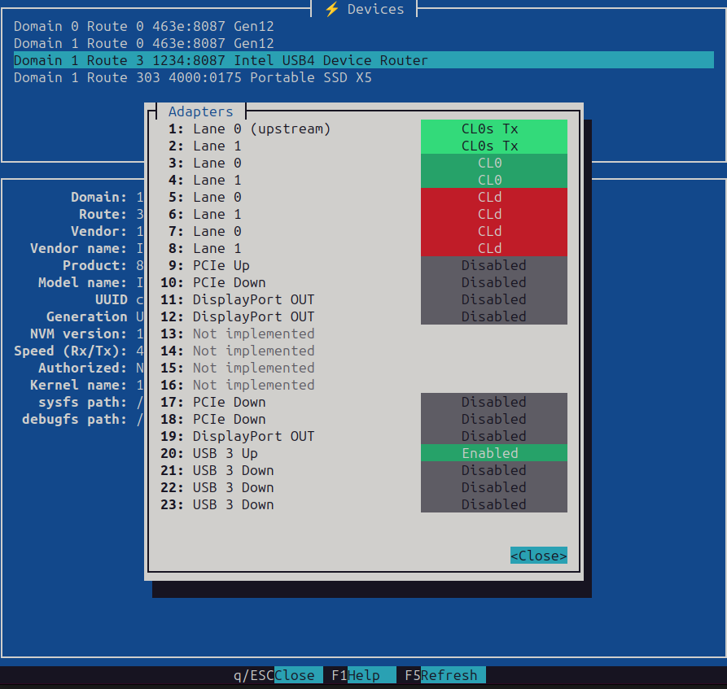

# Thunderbolt/USB4 debugging tools

This is a collection of tools for Linux Thunderbolt/USB4 development,
debugging and validation but may be useful to others as well. This
consists of a library (`tbtools`) that can be used as standalone for a
custom tools, and a basic set of debugging tools built on top of this
library.

Following tools are currently available:

`tblist`
: Lists all the Thunderbolt/USB4 devices, including retimers.

`tbauth`
: Authorizes and De-authorizes (if supported) devices.

`tbadapters`
: Displays all adapters of given router.

`tbdump`
: Reads registers from various config spaces.

`tbget`
: Read specified registers from various config spaces. This is similar
  to `tbdump` but more suitable for scripting.

`tbset`
: Write various config spaces. In order to write registers the kernel
  must have `CONFIG_USB4_DEBUGFS_WRITE=y` set.

`tbmargin`
: Run receiver lane margining on given USB4 port. This requires that the
  kernel is build with `CONFIG_USB4_DEBUGFS_MARGINING=y` set.

`tbpd`
: Type-C port power delivery control. Currently only supports ChromeOS
  style through their embedded controller. To use this on Chromebooks
  you need to enable `CONFIG_CROS_EC_CHARDEV` in the kernel config.

`tbtrace`
: Helper utility for tracing the control channel traffic. This requires
  that the kernel driver has tracepoint support. If you need to enable
  tracing already from boot, you can pass `trace_event=thunderbolt:*` in
  the kernel command line. All this also requires that you have
  `CONFIG_TRACING=y` in your kernel config.

`tbman`
: Live device manager tool. This can be used to view the device topology
  in more visual manner. This too requires `debugfs` access but mounts
  it automatically (which implies that the user needs to have `root`
  privileges).



## Building

The tools are written in Rust so you need to have Rust build tools
installed. Check from [Rust home page](https://www.rust-lang.org/tools/install)
how to install it if not already installed.

You can the build the tools by running
```
$ cargo build
```

If you don't need all the tools you can build just the binaries you want
by passing `--bin` option to cargo:
```
$ cargo build --bin tblist --bin tbdump
```

## Installing

You can also install the tools to the default Cargo directory by running

```
$ cargo install --path .
```

Selected binaries can be installed using `--bin` option similar than
with `cargo build` above.

## Uninstalling

To uninstall the binaries, run

```
$ cargo uninstall
```

## Buildroot

You can enable tbtools in [buildroot](https://github.com/andy-shev/buildroot)
by setting `BR2_PACKAGE_TBTOOLS=y` (or select Target Packages -> Debugging,
profiling and benchmark -> tbtools).

## Addressing

All the tools that take device (router, host, retimer) address use
similar addressing than the kernel. For example a second depth router
(or host) as in the below kernel device name:
```
  0-301
  ^  ^
  |  |
  |  +---- route == 0x301
  +------- domain == 0
```
Can be addressed in the tools such as `tbauth` like:
```
  # tbauth -d 0 -r 301
```
And a retimer such as this:
```
  0-0:3.1
  ^ ^ ^ ^
  | | | |
  | | | +- index == 1
  | | +--- adapter == 3
  | +----- route == 0x0
  +------- domain == 0

```
Can be addressed in a tool that accepts retimers such as `tbmargin`
using following command line:
```
  # tbmargin -d 0 -r 0 -a 3 -i 1
```
Any adapter can be addressed in the same way. For example host router
(kernel name `0-0`) lane adapter `1` can be addressed like below
(command dumps 10 first double words of the adapter config space):
```
  # tbdump -d 0 -r 0 -a 1 -N 10 0
```

## Named registers

The library currently knows the names of registers in USB4 spec and
these are available in tools suchs as `tbdump`, `tbget` and `tbset`. For
instance reading `PORT_CS_18` register of downstream port of the host
router can also be done like this:
```
# tbdump -r 0 -N 1 -a 3 PORT_CS_18 -vv
0x00a2 0x00000410 0b00000000 00000000 00000100 00010000 PORT_CS_18
  [00:07]       0x10 Cable USB4 Version
  [08:08]        0x0 Bonding Enabled (BE)
  [09:09]        0x0 TBT3-Compatible Mode (TCM)
  [10:10]        0x1 CLx Protocol Support (CPS)
  [11:11]        0x0 RS-FEC Enabled (Gen 2) (RE2)
  [12:12]        0x0 RS-FEC Enabled (Gen 3) (RE3)
  [13:13]        0x0 Router Detected (RD)
  [16:16]        0x0 Wake on Connect Status
  [17:17]        0x0 Wake on Disconnect Status
  [18:18]        0x0 Wake on USB4 Wake Status
  [19:19]        0x0 Wake on Inter-Domain Status
  [20:20]        0x0 Cable Gen 3 Support (CG3)
  [21:21]        0x0 Cable Gen 4 Support (CG4)
  [22:22]        0x0 Cable Asymmetric Support (CSA)
  [23:23]        0x0 Cable CLx Support (CSC)
  [24:24]        0x0 AsymmetricTransitionInProgress (TIP)
```
For a accessing single fields, `tbget` and `tbset` can be used instead.
They accept the long names and the short ones. The below commands read
the same field in `PORT_CS_18` register:
```
  # tbget -r 0 -a 1 "PORT_CS_18.Cable Asymmetric Support"
  0x0
  # tbget -r 0 -a 1 PORT_CS_18.CSA
  0x0
```

For write side, `tbset` allows to write register fields using their
names, for example:
```
  # tbset -r 0 -a 1 PORT_CS_19.DPR=1
```

The currently known registers can be seen in [registers.json](src/data/registers.json).

## Scripting

Some of the tools, such as `tblist` and `tbadapters` accept `-S` option.
This turns the output into [CSV](https://datatracker.ietf.org/doc/html/rfc4180)
format that should be more suitable for parsing in scripts. For example:
```
# tblist -S
domain,route,adapter,index,vendor,device,vendor_name,device_name,type
0,0,,,7eb2,8087,Intel,Gen14,Router
0,1,,,1234,8087,Intel Thunderbolt generic vendor name,Intel Thunderbolt generic model name,Router
1,0,,,7eb2,8087,Intel,Gen14,Router
```

The field ordering is guaranteed not to change but it is possible that
more fields will be added in the future at the end.

## Debug logs

In addition to these the kernel driver logs useful information when
debug logging is enabled. You can do this either by passing
`thunderbolt.dyndbg=+p` in the kernel command line, or runtime by:
```
  # echo -n 'module thunderbolt =p' > /sys/kernel/debug/dynamic_debug/control
```
The logs can be read by running `dmesg` command. The kernel needs to
have `CONFIG_DYNAMIC_DEBUG=y` set.

## Tracing

Recent addition to the kernel driver allows tracing of the transport
layer control packets. There is a tool `tbtrace` that can be used to
control this.

First you enable tracing:
```
  # tbtrace enable
```
Then do whatever you want to trace. Once you are done you can stop the
tracing:
```
  # tbtrace disable
```
You can then dump the tracing buffer in parsed format. If you run
against live system you can ask more details such as registers being
accessed and their contents. Note it is recommended that you don't have
tracing enabled at this point if you use `-vv` because this causes the
tool itself to perform lots of register accesses that fill up the trace
buffer as well.
```
  # tbtrace dump -vv
  [   186.463000] tb_tx Read Request Domain 0 Route 0 Adapter 9
                  0x0000 0x00000000 0b00000000 00000000 00000000 00000000 ....        Route String High
                  0x0001 0x00000000 0b00000000 00000000 00000000 00000000 ....        Route String Low
                  0x0002 0x02482039 0b00000010 01001000 00100000 00111001 .H.9
                    [00:12]       0x39 Address
                    [13:18]        0x1 Read Size
                    [19:24]        0x9 Adapter Num
                    [25:26]        0x1 Configuration Space (CS) → Adapter Configuration Space
                    [27:28]        0x0 Sequence Number (SN)
  [   186.463359] tb_rx Read Response Domain 0 Route 0 Adapter 9
                  0x0000 0x80000000 0b10000000 00000000 00000000 00000000 ....        Route String High
                  0x0001 0x00000000 0b00000000 00000000 00000000 00000000 ....        Route String Low
                  0x0002 0x02482039 0b00000010 01001000 00100000 00111001 .H.9
                    [00:12]       0x39 Address
                    [13:18]        0x1 Read Size
                    [19:24]        0x9 Adapter Num
                    [25:26]        0x1 Configuration Space (CS) → Adapter Configuration Space
                    [27:28]        0x0 Sequence Number (SN)
                  0x0003 0x2186043a 0b00100001 10000110 00000100 00111010 .... 0x0039 ADP_PCIE_CS_0
                    [00:07]       0x3a Next Capability Pointer
                    [08:15]        0x4 Capability ID
                    [16:16]        0x0 Link
                    [17:17]        0x1 TX EI
                    [18:18]        0x1 RX EI
                    [19:19]        0x0 RST
                    [25:28]        0x0 LTSSM
                    [31:31]        0x0 Path Enable (PE)
  ...
```

## Development

Please make sure following commands pass without warnings before
submitting patches:

```
  $ cargo fmt
  $ cargo test
  $ cargo clippy
```

## Documentation

Documentation of the library itself can be generated by running `cargo doc`. The documentaiton is accessible through `target/doc/tbtools/index.html`.
